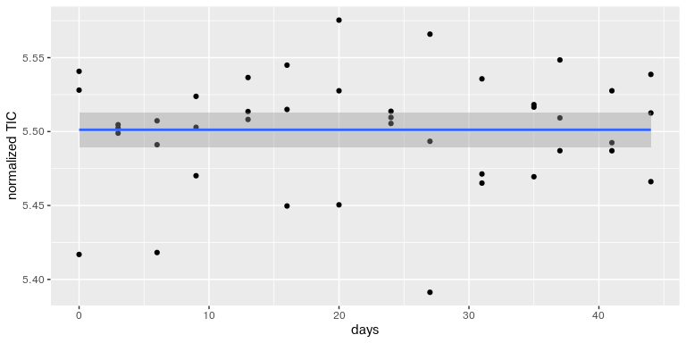
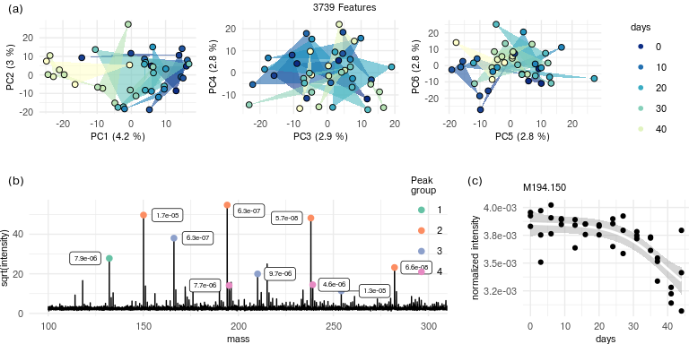
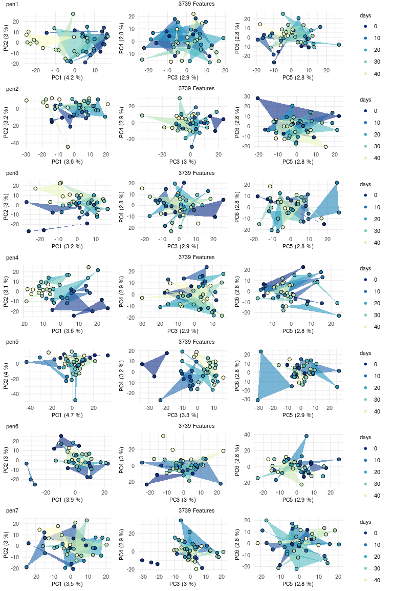

Statistical modelling investigation of MALDI MS based approaches for
document examination
================
Johan Lassen
2023-03-13

- <a href="#1-introduction" id="toc-1-introduction">1 Introduction</a>
- <a href="#2-preprocessing" id="toc-2-preprocessing">2 Preprocessing</a>
  - <a href="#21-peak-calling" id="toc-21-peak-calling">2.1 Peak Calling</a>
  - <a href="#22-parse-metadata" id="toc-22-parse-metadata">2.2 Parse
    metadata</a>
  - <a href="#23-normalization-and-data-cleaning"
    id="toc-23-normalization-and-data-cleaning">2.3 Normalization and data
    cleaning</a>
  - <a href="#24-visualize-the-spectra-of-the-average-sample"
    id="toc-24-visualize-the-spectra-of-the-average-sample">2.4 Visualize
    the spectra of the average sample</a>
- <a href="#3-unsupervised-machine-learning"
  id="toc-3-unsupervised-machine-learning">3 Unsupervised Machine
  Learning</a>
  - <a href="#31-colored-by-pen-brand" id="toc-31-colored-by-pen-brand">3.1
    Colored by pen brand</a>
  - <a href="#32-colored-by-time-since-deposition"
    id="toc-32-colored-by-time-since-deposition">3.2 Colored by time since
    deposition</a>
- <a href="#4-supervised-machine-learning-of-ink-discrimination"
  id="toc-4-supervised-machine-learning-of-ink-discrimination">4
  Supervised Machine Learning of Ink Discrimination</a>
  - <a href="#41-ink-discrimination-model"
    id="toc-41-ink-discrimination-model">4.1 Ink Discrimination Model</a>
  - <a href="#42-ink-discrimination-performance"
    id="toc-42-ink-discrimination-performance">4.2 Ink Discrimination
    Performance</a>
  - <a href="#43-validation-data-predictions"
    id="toc-43-validation-data-predictions">4.3 Validation Data
    Predictions</a>
- <a href="#5-supervised-learning-of-pen-age"
  id="toc-5-supervised-learning-of-pen-age">5 Supervised learning of pen
  age</a>
  - <a href="#51-model-of-all-pens-together"
    id="toc-51-model-of-all-pens-together">5.1 Model of all pens
    together</a>
  - <a href="#52-model-age-of-ink-in-individual-pens"
    id="toc-52-model-age-of-ink-in-individual-pens">5.2 Model age of ink in
    individual pens</a>
  - <a href="#53-univariate-analysis-of-age-correlated-features-in-each-pen"
    id="toc-53-univariate-analysis-of-age-correlated-features-in-each-pen">5.3
    Univariate analysis of age correlated features in each pen</a>
  - <a
    href="#54-principal-component-analysis-of-linear-trends-in-aging-ink-pen-1"
    id="toc-54-principal-component-analysis-of-linear-trends-in-aging-ink-pen-1">5.4
    Principal component analysis of linear trends in aging ink (pen 1)</a>

# 1 Introduction

This package is the supporting code base and data for the publication
**Statistical modelling investigation of MALDI MS based approaches for
document examination**.

By installing the package the pooled spectra are downloaded along with
the code base. The README will take you through the statistical analysis
performed in the paper.

To cite the paper: DOI:

Please install the package (and download the data) by running:

``` r
# install.packages("devtools")
devtools::install_github("johanLassen/ink")
```

<details style="display:inline">
<summary>

Show Code

</summary>

``` r
# Data wrangling packages
library(tibble)
library(tidyr)
library(dplyr)
library(purrr)

# MALDI packages
library(MALDIquant)
library(MALDIquantForeign)

# ML packages
library(umap)
library(glmnet)

# Visualization packages
library(ggplot2)
library(cowplot)
library(ggrepel)
library(knitr)

# Project package
library(ink)
```

</details>

# 2 Preprocessing

## 2.1 Peak Calling

We peak call the training data and validation data simultaneously to
ensure both data sets have the same peaks

<details style="display:inline">
<summary>

Show Code

</summary>

``` r
# The two included datasets (msdata in maldiquant)
data(training_data)
data(validation_data)
# a <-
#   gsub("signature", "", names(validation_data)) |>
#   stringr::str_split("_") |>
#   map_chr(~paste0("signature", as.numeric(.x[1])-2, "_", .x[2], "_", .x[3]))
# 
# names(validation_data) <- a
# 
# usethis::use_data(validation_data, overwrite = T)

# Concatenate data to one list
msdata <- c(training_data, validation_data)

# Preprocess data
Methods        <- c("SavitzkyGolay", "MovingAverage")
spectra        <- transformIntensity(msdata, method="log2")
spectra        <- smoothIntensity(spectra, method=Methods[1],halfWindowSize=4)
spectra        <- removeBaseline(spectra, method="SNIP", iterations=100) #100
spectra        <- alignSpectra(spectra, halfWindowSize = 20, SNR = 4)
peaks_full     <- detectPeaks(spectra, SNR=3, halfWindowSize=20) # 15
peaks_full     <- binPeaks(peaks_full, tolerance=60*1e-6) #150
peaks_full     <- filterPeaks(peaks_full, minFrequency=0.01)
featureMatrix  <- intensityMatrix(peaks_full, spectra)
intensity_data <- as_tibble(featureMatrix)

# Set colnames of feature tibble
colnames(intensity_data) <- paste0("M", round(as.numeric(colnames(intensity_data)), 4))

# Visualize the head
head(intensity_data)[,1:10] |> knitr::kable()
```

</details>

| M100.0978 | M100.1042 | M100.1086 | M100.1359 | M100.1558 | M101.0174 | M101.0957 | M102.0789 | M102.1139 | M104.1195 |
|----------:|----------:|----------:|----------:|----------:|----------:|----------:|----------:|----------:|----------:|
|  2.256795 |  1.501278 |  1.685417 |  1.664774 |  1.649710 | 2.3867975 | 2.3582668 |  1.499466 |  4.984403 |  3.428293 |
|  2.354259 |  2.200811 |  2.107518 |  1.569836 |  1.876741 | 1.7307382 | 1.7229013 |  1.879449 |  3.921677 |  2.815165 |
|  2.390773 |  2.255975 |  2.253053 |  2.234767 |  2.221423 | 1.7755028 | 1.8575855 |  1.951228 |  1.490928 |  2.121545 |
|  2.422719 |  2.151157 |  1.902968 |  1.748592 |  1.735765 | 0.6691031 | 0.5455215 |  1.942464 |  2.067377 |  1.702180 |
|  3.445834 |  2.914731 |  2.678153 |  2.271718 |  1.973973 | 1.0923073 | 2.4772140 |  1.720487 |  1.605792 |  2.135995 |
|  1.024238 |  1.091803 |  1.137488 |  1.514281 |  2.123404 | 1.6620962 | 1.4085513 |  2.291243 |  4.715526 |  2.396093 |

## 2.2 Parse metadata

The filenames and the chunk below contain the information needed for the
analysis.  

<details style="display:inline">
<summary>

Show Code

</summary>

``` r
inkdata <- 
  tibble(
    pen   = gsub(".*pen|_.*", "", names(msdata)),
    index = gsub(".*index|_rep.*", "", names(msdata)),
    rep   = gsub(".*_rep|.mzML", "", names(msdata))
  ) |>
  mutate(
    age = 44-case_when(
      index == 0~0,
      index == 1~3,
      index == 2~7,
      index == 3~9,
      index == 4~13,
      index == 5~17,
      index == 6~20,
      index == 7~24,
      index == 8~28,
      index == 9~31,
      index == 10~35,
      index == 11~38,
      index == 12~41,
      index == 13~44
    ),
    type = case_when(grepl("blank", pen)~"blank",grepl("sign", pen)~"validation", !grepl("blank", pen)~"sample")
  ) |>
  bind_cols(intensity_data)

head(inkdata)[,1:10] |> knitr::kable()
```

</details>

| pen | index | rep | age | type   | M100.0978 | M100.1042 | M100.1086 | M100.1359 | M100.1558 |
|:----|:------|:----|----:|:-------|----------:|----------:|----------:|----------:|----------:|
| 1   | 0     | 1   |  44 | sample |  2.256795 |  1.501278 |  1.685417 |  1.664774 |  1.649710 |
| 1   | 0     | 2   |  44 | sample |  2.354259 |  2.200811 |  2.107518 |  1.569836 |  1.876741 |
| 1   | 0     | 3   |  44 | sample |  2.390773 |  2.255975 |  2.253053 |  2.234767 |  2.221423 |
| 1   | 1     | 1   |  41 | sample |  2.422719 |  2.151157 |  1.902968 |  1.748592 |  1.735765 |
| 1   | 1     | 2   |  41 | sample |  3.445834 |  2.914731 |  2.678153 |  2.271718 |  1.973973 |
| 1   | 1     | 3   |  41 | sample |  1.024238 |  1.091803 |  1.137488 |  1.514281 |  2.123404 |

## 2.3 Normalization and data cleaning

<details style="display:inline">
<summary>

Show Code

</summary>

``` r

# container to ease preprocessing
ms <- list()
ms$values  <- inkdata |> select(starts_with("M")) 
ms$rowinfo <- inkdata |> select(-starts_with("M")) |> rowid_to_column()


# Remove features with intensities less than 1.5 times the median of the blank intensity
feature_in_blank <-
  ms$rowinfo |>
  bind_cols(ms$values) |>
  pivot_longer(cols = starts_with("M")) |>
  group_by(name, type) |>
  summarise(median_variance = mad(value)) |>
  pivot_wider(names_from = type, values_from = median_variance) |>
  mutate(good_feature = sample > (blank*1.5))

good_features <- feature_in_blank |> filter(good_feature) |> pull(name)
ms$values     <- ms$values[,good_features]
ms            <- ms |> transform_log() |> normalize_robust_row()
inkdata2      <- ms |> bind_cols()
```

</details>

## 2.4 Visualize the spectra of the average sample

Plotting the pooled spectra from the experiment across all time points.

<details>
<summary>

source

</summary>

``` r
# Extract mass and intensity from the raw data
df <- 
  msdata |> 
  map(~tibble(mass = mass(.x), intensity = intensity(.x))) |>
  bind_rows(.id = "file") |> 
  mutate(pen = gsub(".*pen|_index.*", "", file))

# Pool scans (m/z - intensity pairs) into bins of 5 to reduce computations. The bins are summarised by mean values of intensity.
df2 <- 
  df |>
  filter(pen %in% 1:7) |> 
  group_by(pen, mass) |> 
  summarise(intensity = mean(intensity)) |> 
  group_by(pen) |> 
  mutate(rowid = (row_number() %/% 5)) |> 
  group_by(rowid, pen) |> 
  summarise(intensity = mean(intensity), mass = mean(mass))
  
# Visualize the spectra
(spectra_plots <- 
  df2 |> 
  group_by(pen) |> 
  mutate(intensity = zoo::rollmean(intensity, 20, fill = NA, align = 'right')) |> 
    mutate(pen = paste("pen", pen)) |> 
  ggplot(aes(x=mass, y=intensity^0.5))+
  geom_line()+
  facet_wrap(~pen, scales = "free", ncol = 1)+
  theme_minimal()+
    labs(x = "m/z", y="sqrt(intensity)")+
    theme(axis.text = element_text(size=8), axis.title = element_text(size=8))
)
```

</details>


# 3 Unsupervised Machine Learning

We use the unsupervised machine learning algorithms PCA and UMAP as
these cover linear and non-linear data. As we see the umap separates the
pen types well.

Define data used for the algorithms

First we’ll assign feature values to x, time points to age, and pen
brand to pen.

<details style="display:inline">
<summary>

Show Code

</summary>

``` r
pen       <- paste0("pen", inkdata2 |> filter(type == "sample") |> pull(pen))
age       <- inkdata2 |> filter(type == "sample") |> pull(age)
x         <- inkdata2 |> filter(type == "sample") |> select(starts_with("M"))
```

</details>

## 3.1 Colored by pen brand

Code for making the umap

<details style="display:inline">
<summary>

Show Code

</summary>

``` r
um <- umap::umap(x)

umap_plot <- 
    um$layout |> 
    as_tibble() |> 
    mutate(pen = pen) |> 
    ggplot(aes(x=V1, y=V2, fill = pen))+
    geom_point(color = "white", shape=21)+
    scale_fill_brewer(palette = "Set1")+
    theme_minimal()+
    labs(x = "umap1", y="umap2", title = "umap")+
    theme(
      axis.text = element_text(size=8),
      axis.title = element_text(size=8),
      plot.title = element_text(size=8),
      legend.text = element_text(size=8),
      legend.title = element_text(size=8)
    )
```

</details>

Code for making the PCA

<details style="display:inline">
<summary>

Show Code

</summary>

``` r
pca <- prcomp(x)
variance_explained <- summary(pca)$importance[2,1:2]
variance_explained <- round(variance_explained, 3)*100

pca_plot <- 
  pca$x |> 
  as_tibble() |> 
  mutate(pen = pen) |> 
  ggplot(aes(x=PC1, y=PC2, fill = pen))+
  geom_point(color = "white", shape=21)+
  scale_fill_brewer(palette = "Set1")+
    labs(title = "pca", x=paste0("PC1 (", variance_explained[1], "%)"), y=paste0("PC2 (", variance_explained[2], "%)"))+
  theme_minimal()+
    theme(
      axis.text = element_text(size=8),
      axis.title = element_text(size=8),
      plot.title = element_text(size=8),
      legend.text = element_text(size=8),
      legend.title = element_text(size=8)
    )
```

</details>

Combine the umap plot and the pca plot

<details style="display:inline">
<summary>

Show Code

</summary>

``` r
legend             <- get_legend(pca_plot + ggplot2::theme(legend.box.margin = ggplot2::margin(0, 0, 0, 5)))
unsupervised_plot  <- plot_grid(pca_plot+theme(legend.position = "none"), umap_plot+theme(legend.position = "none"), ncol = 2)
(unsupervised_plot2 <- plot_grid(unsupervised_plot, legend, rel_widths = c(8,1)))
```

</details>


## 3.2 Colored by time since deposition

Code for the umap

<details style="display:inline">
<summary>

Show Code

</summary>

``` r
um <- umap::umap(x)

umap_plot <- 
    um$layout |> 
    as_tibble() |> 
    mutate(age = age) |> 
    ggplot(aes(x=V1, y=V2, fill = age))+
    geom_point(color = "white", shape=21)+
    scale_fill_distiller(palette = "YlGnBu")+
    theme_minimal()+
    labs(x = "umap1", y="umap2", title = "umap")+
    theme(
      axis.text = element_text(size=8),
      axis.title = element_text(size=8),
      plot.title = element_text(size=8),
      legend.text = element_text(size=8),
      legend.title = element_text(size=8)
    )
```

</details>

Code for the PCA

<details style="display:inline">
<summary>

Show Code

</summary>

``` r
pca <- prcomp(x)
variance_explained <- summary(pca)$importance[2,1:2]
variance_explained <- round(variance_explained, 3)*100
pca_plot <- 
  pca$x |> 
  as_tibble() |> 
  mutate(age = age) |> 
  ggplot(aes(x=PC1, y=PC2, fill = age))+
  geom_point(color = "white", shape=21)+
  scale_fill_distiller(palette = "YlGnBu")+
  labs(title = "pca", x=paste0("PC1 (", variance_explained[1], "%)"), y=paste0("PC2 (", variance_explained[2], "%)"))+
  theme_minimal()+
    theme(
      axis.text = element_text(size=8),
      axis.title = element_text(size=8),
      plot.title = element_text(size=8),
      legend.text = element_text(size=8),
      legend.title = element_text(size=8)
    )
```

</details>

Combined unsupervised age plot

<details style="display:inline">
<summary>

Show Code

</summary>

``` r
legend             <- get_legend(pca_plot + ggplot2::theme(legend.box.margin = margin(0, 0, 0, 5)))
unsupervised_plot  <- plot_grid(pca_plot+theme(legend.position = "none"), umap_plot+theme(legend.position = "none"), ncol = 2)
(unsupervised_plot2 <- plot_grid(unsupervised_plot, legend, rel_widths = c(8,1)))
```

</details>

<!-- -->

# 4 Supervised Machine Learning of Ink Discrimination

Define data for the analysis. x is the feature data, age is the days,
pen is the penID used for classification. The signatures are exported
average spectra from the 3 regions of interest from signature 1, 2, 3,
4, and 5.

<details style="display:inline">
<summary>

Show Code

</summary>

``` r
pen       <- paste0("pen", inkdata2 |> filter(type == "sample") |> pull(pen))
age       <- inkdata2 |> filter(type == "sample") |> pull(age)
x         <- inkdata2 |> filter(type == "sample") |> select(starts_with("M"))
val_data  <- inkdata2 |> filter(type == "validation") |> select(starts_with("M"))
signature <- inkdata2 |> filter(type == "validation") |> select(-starts_with("M")) |> pull(index)
```

</details>

## 4.1 Ink Discrimination Model

We run the cross-validation for loop to obtain:

1.  Cross validated hold out class predictions (variable: preds)
2.  Cross validated hold out class probabilities (variable: preds)
3.  For each fold predict (1 and 2) for the validation data (to average
    in the end)
4.  Get the cross validated feature impact on the observations. I.e.,
    how much does feature X influence the prediction of a given sample.

<details style="display:inline">
<summary>

Show Code

</summary>

``` r

preds                  <- list()
shap_impact_all        <- list()
signature_preds        <- list()
shap_impact_signatures <- list()

for (i in 1:length(unique(age))){
  
  # Hold out one triplicate at a time (i.e., all triplicates in one time point)
  timepoint <- unique(age)[i]
  test_x    <- x[age==timepoint,]
  train_x   <- x[age!=timepoint,]
  test_y    <- pen[age==timepoint]
  train_y   <- pen[age!=timepoint]
  
  # make cross validated model on the training data
  fit_pen <- glmnet::cv.glmnet(
    x=as.matrix(train_x), 
    y=as.numeric(gsub("pen", "", train_y)), 
    family = "multinomial", 
    type.multinomial = "grouped", 
    nfolds = 10)
  
  # get the important features (with beta coefficients > 0)
  feature_importance <- 
    coef(fit_pen) |> 
    map(as.matrix) |> 
    map(as_tibble, rownames="feature") |> 
    map(magrittr::set_colnames, c("feature", "value")) |>
    map(arrange, -abs(value)) |> 
    map(filter, abs(value)>0)
  
  # 
  m <- coef(fit_pen) |> 
    map(as.matrix) |> 
    map(as_tibble, rownames = "feature") |>
    bind_rows(.id = "pen") |> # One feature importance matrix per pen
    pivot_wider(values_from = "1", names_from = "feature") |> 
    select(-pen) |> 
    as.matrix()

  
  used_features <- feature_importance |> bind_rows() |> pull(feature) |> unique()
  
  # Make the test data numeric matrix
  inkdata_matrix <- 
    test_x |> 
    mutate("intercept" = 1) |> # The bias term for linear modeling
    select(intercept, starts_with("M")) |> 
    as.matrix()
  
  predicted <- predict(fit_pen, as.matrix(test_x), s = "lambda.min", type = "class") |> as.numeric()
  
  
  # Get the cross validation data impact
  impact <- 
    as.list(1:nrow(inkdata_matrix)) |> 
    map(~as_tibble(inkdata_matrix[.x,]*m)) |> # Matrix multiplication of feature values and model coefficients
    map(select, all_of(used_features)) |> 
    imap(~.x[predicted[.y],]) |> 
    bind_rows(.id = "index") |> 
    mutate(pred = predicted, obs = test_y, index = which(age==timepoint)) |> 
    select(pred, obs, everything())
  
  shap_impact_all[[i]] <- impact
  
  # Get the signature validation data impact
  inkdata_matrix <- 
    val_data |> 
    mutate("intercept" = 1) |> 
    select(intercept, starts_with("M")) |> 
    as.matrix()
  
  predicted <- predict(fit_pen, as.matrix(val_data), s = "lambda.min", type = "class") |> as.numeric()
  impact <- 
    as.list(1:nrow(inkdata_matrix)) |> 
    map(~as_tibble(inkdata_matrix[.x,]*m)) |> 
    map(select, all_of(used_features)) |> 
    imap(~.x[predicted[.y],]) |> 
    bind_rows(.id = "index") |> 
    mutate(pred = predicted, obs = signature) |> 
    select(pred, obs, everything(), -index)
  
  shap_impact_signatures[[i]] <- impact
  
  # Save signature predictions
  signature_preds[[i]] <- predict(fit_pen, as.matrix(val_data), type = "response")
  
  # Save cross validation predictions
  preds[[i]] <- predict(fit_pen, as.matrix(test_x), type="response") |> as_tibble() |> mutate(obs = test_y, pred = predict(fit_pen, as.matrix(test_x), type="class"))
}

# Concatenate all the feature importance data
feature_importance <- shap_impact_all |> bind_rows() |> select(starts_with("M")) |> map_dbl(var, na.rm=T) |> sort(decreasing = T)
```

</details>

## 4.2 Ink Discrimination Performance

Plot the log10 odds for the ink discrimination predictions

<details style="display:inline">
<summary>

Show Code

</summary>

``` r
(
  predictional_performance <-
    preds |> 
    bind_rows() |> 
    magrittr::set_colnames(c(paste0("pen", 1:7), "obs", "pred")) |> 
    mutate(pred = paste0("pen ", unlist(pred))) |>
    pivot_longer(starts_with("pen")) |> 
    mutate(value = log10(value/(1-value))) |> 
    ggplot(aes(x=name, y=value, fill=pred)) + 
    geom_boxplot(outlier.size = 0.5)+
    scale_fill_brewer(palette = "Set1")+
    scale_color_brewer(palette = "Set1")+
    guides(fill = guide_legend(title = "Predicted pen"))+
    labs(y = "log10(OR)", x = "Donor pen", title = "cross validated pen predictions")+
    theme_minimal()+
    theme(axis.text = element_text(size=8),
          axis.title = element_text(size=8),
          plot.title = element_text(size=8),
          legend.title = element_text(size=8),
          legend.text = element_text(size=8),
          legend.key.size = unit(.5, 'cm'))
)
```

</details>

<!-- -->

## 4.3 Validation Data Predictions

Obtain mean probabilities for each validation signature replicate from
the ML cross validation results.

<details style="display:inline">
<summary>

Show Code

</summary>

``` r
signature <- inkdata2 |> filter(type == "validation") |> pull(index)
mean_prediction <- 
  signature_preds |> 
  map(as_tibble) |> 
  map(magrittr::set_colnames, paste0("pen", 1:7)) |> 
  map(mutate, "segment" = signature) |> 
  map(pivot_longer, cols = starts_with("p"))  |> 
  bind_rows() |> 
  group_by(name, segment) |> 
  summarise(value = mean(value)) |> 
  pivot_wider(names_from = name, values_from = value)


(
blinded_predictions <- 
  mean_prediction |> 
  pivot_longer(cols = starts_with("pen")) |> 
  mutate(
    signature = gsub("_.*", "", segment), 
    name1 = gsub(".*_", "", segment), 
    techrep = gsub("signature._|_john|_smith", "", segment), 
    name_rep = factor(paste(name1, techrep), levels = rev(c("john 1", "john 2", "john 3", "smith 1", "smith 2", "smith 3")))) |> 
  ggplot(aes(y=name_rep, x=value, fill=name))+
  geom_col()+
  scale_fill_brewer(palette = "Set1")+
  facet_wrap(~signature, ncol=1, scales = "free")+
  theme_minimal()+
  guides(fill = guide_legend(title = "Predicted"))+
  labs(x="p(pen)", y="Signature")+
    theme(axis.text = element_text(size=8),
          axis.title = element_text(size=8),
          plot.title = element_text(size=8),
          legend.title = element_text(size=8),
          legend.text = element_text(size=8))
)
```

</details>


### 4.3.1 Assessment of the predictions - do they fit into the distributions of the training data?

> We are especially interested in signature 4 as it is uncertain in its
> “john” predictions

The values on y are the beta values of the linear model multiplied onto
the intensity of their variable (feature). I.e., if we have a model with
only one predictor the linear model would be: y = a\*x + b. In this case
the value on the y-value on the plot would be given by a multiplied by
x.

### 4.3.2 assessment of all predictions - filled by predicted value

<details style="display:inline">
<summary>

Show Code

</summary>

``` r
n = 10

# We call it shap values because the impact is proportional to the shapley value in linear models  - but it is not entirely the same.
validation_shap <- 
  shap_impact_signatures |> 
  bind_rows() |> 
  select(pred, obs, all_of(names(feature_importance)[1:n])) |> 
  pivot_longer(cols = starts_with("M")) |> 
  group_by(obs, name) |> 
  summarise(value = mean(value), pred = pred[1]) |> 
  mutate(id = gsub("signature|_._", "", obs))

true_preds <- 
  validation_shap |> 
  mutate(true_pred = !grepl("signature4_2_john", obs))

(model_impact <- 
  shap_impact_all |> 
  bind_rows() |> 
  select(pred, obs, index, all_of(names(feature_importance)[1:n])) |> 
  pivot_longer(cols = starts_with("M")) |> 
  ggplot(aes(x=value, y=name, color = obs))+
  geom_jitter(alpha = 0.6, height =0.1)+#, position = position_jitterdodge(jitter.height = 0.1, jitter.width = 0.1))+
  geom_point(data = validation_shap, 
             aes(x=value, y=name, fill = paste0("pen", pred)), 
             color = "black", 
             shape=ifelse(true_preds$true_pred, 21, 15), 
             size =ifelse(true_preds$true_pred, 2, 3), 
             show.legend = F)+#,position = position_jitterdodge(jitter.height = 0.1, jitter.width = 0.1))+
  scale_color_brewer(palette = "Set1")+
  scale_fill_brewer(palette = "Set1")+
  theme_minimal()+
  guides(color=guide_legend(
    title = "Prediction", 
    legend.box = "horizontal", 
    #title.position="top", 
    label.position = "top", 
    title.hjust = 0.5,
    nrow=1)
    )+
  labs(x=paste0("impact (intensity"," x ","coefficient)"), y = "")+
  theme(
    legend.position = "bottom", 
    legend.key.width= unit(0.9, 'cm'), 
    legend.title = element_text(size=8), 
    axis.title = element_text(size=8), 
    axis.text = element_text(size=8))
  )
```

</details>

<!-- -->

> NOTICE: At this point we do not know if the predictions are correct.

# 5 Supervised learning of pen age

## 5.1 Model of all pens together

In an ideal world we could date the ink of any pen in the same model,
because certain molecules evaporate or degrade, but our data does not
allow it.

<details style="display:inline">
<summary>

Show Code

</summary>

``` r
pen       <- paste0("pen", inkdata2 |> filter(type == "sample") |> pull(pen))
age       <- inkdata2 |> filter(type == "sample") |> pull(age)
x         <- inkdata2 |> filter(type == "sample") |> select(starts_with("M"))
val_data  <- inkdata2 |> filter(type == "validation") |> select(starts_with("M"))
signature <- inkdata2 |> filter(type == "validation") |> select(-starts_with("M")) |> pull(index)
preds2    <- list()
for (i in 1:length(unique(age))){
    a <- unique(age)[i]
    test_x <- x[age==a,]
    test_y <- age[age==a]
    train_x <- x[age!=a,]
    train_y <- age[age!=a]
    
    fit_age2 <- 
      glmnet::cv.glmnet(
      x=as.matrix(train_x), 
      y=train_y, 
      nfolds = 10)
    
    predicted <- predict(fit_age2, as.matrix(test_x), s = "lambda.min") |> as.numeric()
    preds2[[i]] <- 
      predict(fit_age2, as.matrix(test_x)) |> 
      as_tibble() |> mutate(obs = test_y)
  }

preds2 <- 
  preds2 |> 
  bind_rows() |> 
  magrittr::set_colnames(c("pred", "obs")) |> 
  mutate(RMSE = sqrt(mean((pred-obs)^2)))

(
  all_pen_regression <- 
    preds2 |> 
    ggplot(aes(x=obs, y=pred))+
    geom_point()+
    labs(title = paste0("Predicting age of all pens, RMSE = ", round(preds2$RMSE[1], 2)),
        subtitle = paste0("Performance when always guessing on the mean age, sd(observed) = ", round(sd(preds2$obs), 2)))+
    theme(
      axis.text = element_text(size=8),
      axis.title = element_text(size=8),
      plot.title = element_text(size=8),
      plot.subtitle = element_text(size=8)
    )
)
```

</details>

<!-- -->

## 5.2 Model age of ink in individual pens

<details style="display:inline">
<summary>

Show Code

</summary>

``` r

penwise_age <- list()
for (pen_id in unique(pen)){
  
  age_holdout_fits       <- list()
  preds                  <- list()
  shap_impact_all        <- list()
  signature_preds        <- list()
  shap_impact_signatures <- list()
  
  for (i in 1:length(unique(age))){
    a       <- unique(age)[i]
    test_x  <- x[age==a&pen_id==pen,]
    train_x <- x[age!=a&pen_id==pen,]
    test_y  <- age[age==a&pen_id==pen]
    train_y <- age[age!=a&pen_id==pen]

    fit_age2 <-
      glmnet::cv.glmnet(
      x=as.matrix(train_x),
      y=train_y,
      nfolds = 10)

    feature_importance <-
      coef(fit_age2) |>
      as.matrix() |>
      as_tibble(rownames="feature") |>
      magrittr::set_colnames(c("feature", "value")) |>
      arrange(-abs(value)) |>
      filter(abs(value)>0)

    m <- coef(fit_age2) |>
      as.matrix() |>
      as_tibble(rownames = "feature") |>
      mutate(s1 = as.numeric(s1)) |>
      pivot_wider(names_from = feature, values_from=s1) |>
      as.matrix()

    used_features <- feature_importance |> bind_rows() |> pull(feature) |> unique()

    inkdata_matrix <-
      test_x |>
      mutate("intercept" = 1) |>
      select(intercept, starts_with("M")) |>
      as.matrix()

    predicted <- predict(fit_age2, as.matrix(test_x), s = "lambda.min") |> as.numeric()

    impact <-
      as.list(1:nrow(inkdata_matrix)) |>
      map(~as_tibble(inkdata_matrix[.x,]*m)) |>
      map(select, all_of(used_features)) |>
      bind_rows(.id = "index") |>
      mutate(pred = predicted, obs = test_y, index = which(age==a&pen_id==pen)) |>
      select(pred, obs, everything())

    shap_impact_all[[i]] <- impact

    inkdata_matrix <-
      val_data |>
      mutate("intercept" = 1) |>
      select(intercept, starts_with("M")) |>
      as.matrix()

    age_holdout_fits[[i]] <- fit_age2
    preds[[i]] <-
      predict(fit_age2, as.matrix(test_x)) |>
      as_tibble() |> mutate(obs = test_y, pred = predict(fit_age2, as.matrix(test_x), type="class"))
  }

  feature_importance <- shap_impact_all |> bind_rows() |> select(starts_with("M")) |> map_dbl(var, na.rm=T) |> sort(decreasing = T)

  penwise_age[[pen_id]] <-
    list("feature_importance"=feature_importance,
         "predictions"=preds,
         "hold_out_fits"=age_holdout_fits
         )

}
```

</details>

> Root mean squared error of the age regression result for each pen.
> Most RMSEs are close to the age standard deviation (average point
> distance to the mean age), which represents the simplest model (i.e.,
> the mean). Hence, we can conclude that the inks does not contain much
> aging signal.

<details style="display:inline">
<summary>

Show Code

</summary>

``` r
get_regression_preds <- function(x) {
  x[["predictions"]] |> 
    bind_rows() |> 
    select(pred = lambda.1se, obs)
}

penwise_age |> 
  map(get_regression_preds) |> 
  bind_rows(.id="pen") |> 
  group_by(pen) |> 
  summarise(RMSE = sqrt(mean((pred-obs)^2)),
            sd   = sd(obs))
```

</details>

    ## # A tibble: 7 × 3
    ##   pen    RMSE    sd
    ##   <chr> <dbl> <dbl>
    ## 1 pen1   13.6  14.2
    ## 2 pen2   12.9  14.2
    ## 3 pen3   15.1  14.2
    ## 4 pen4   12.7  14.2
    ## 5 pen5   14.9  14.2
    ## 6 pen6   15.2  14.2
    ## 7 pen7   15.0  14.2

## 5.3 Univariate analysis of age correlated features in each pen

Lets see how the number of correlated (Spearman correlation test)
features per pen compares to the RMSE

<details style="display:inline">
<summary>

Show Code

</summary>

``` r
p_values <- 
  x |>
  mutate(age = age, pen = pen) |> 
  pivot_longer(cols = -c(age, pen)) |> 
  group_by(pen, name) |> 
  summarise(
    correlation = cor(x=value, y=age, method = "spearman"),
    p.value = cor.test(value, age, method = "spearman")$p.value,
    fdr = p.adjust(p.value, method = "fdr")
  )

fdr_count <- 
  p_values |> 
  group_by(pen) |> 
  count("significant" = fdr<0.01) |> 
  filter(significant) |> 
  arrange(-n)

ml_performance_RMSE <- penwise_age |> 
  map(get_regression_preds) |> 
  bind_rows(.id="pen") |> 
  group_by(pen) |> 
  summarise(RMSE = sqrt(mean((pred-obs)^2)),
            sd   = sd(obs))

fdr_count |> ungroup() |>  
  left_join(ml_performance_RMSE) |> 
  select(pen, fdr = n, RMSE)
```

</details>

    ## # A tibble: 7 × 3
    ##   pen     fdr  RMSE
    ##   <chr> <int> <dbl>
    ## 1 pen1    122  13.6
    ## 2 pen4    117  12.7
    ## 3 pen5     68  14.9
    ## 4 pen2     66  12.9
    ## 5 pen3     64  15.1
    ## 6 pen6     51  15.2
    ## 7 pen7     44  15.0

Here we see the position of many of the age correlated features in
pen 1. They belong to a PEG.

These are the most correlated peaks. Not extremely informative in a ML
context as they contain a high “within technical replicate” variation at
each time point - e.g., for most correlations the triplicate of day 0
overlaps with the triplicate of day 44 even though their mean
intensities are different.

<details style="display:inline">
<summary>

Show Code

</summary>

``` r
features <- 
  p_values |> 
  filter(pen=="pen1") |> 
  slice_min(fdr, n=20)

x |> 
  mutate(age=age, pen=pen) |> 
  filter(pen == "pen1") |> 
  select(age, all_of(features$name)) |> 
  pivot_longer(cols = -age) |> 
  ggplot(aes(x=age, y=value))+
  geom_smooth(method = "lm", se = F, color  = "gray50")+
  geom_point()+
  facet_wrap(~name, scales = "free")
```

</details>

<!-- -->

Here we visualise some of the most correlated peaks in pen 1 as they
seem to belong to the same cluster (PEG and adducts). The plot is
labelled with m/z values.

<details style="display:inline">
<summary>

Show Code

</summary>

``` r
important_peaks <- 
  tibble(mass_preprocessed = as.numeric(gsub("M", "", features$name)), important = TRUE,
         fdr  = features$fdr)

# Map preprocessed data to raw data
indeces <- sapply(important_peaks$mass_preprocessed, function(x) which.min(abs(df2[df2$pen == 1,]$mass - x)))
important_peaks$intensity = df2[df2$pen == 1,]$intensity[indeces]
important_peaks$mass = df2[df2$pen == 1,]$mass[indeces]


# Automatic polymer detection

assignments <- list("indexed" = c(), "id" = c())
min_mass <- 100
max_mass <- 300
important_peaks <- important_peaks |> filter(mass > min_mass & mass < max_mass) |> arrange(mass)

index = 1
for (index in 1:nrow(important_peaks)){
  
  if (important_peaks$mass[index] %in% assignments$id){next}
  new_id   <- ifelse(is.null(assignments$indexed[length(assignments$indexed)]), 1, assignments$indexed[length(assignments$indexed)]+1)
  sequence <- seq(important_peaks$mass[index], max_mass, 44.05)
  matches  <- which(round(important_peaks$mass) %in% round(sequence))
  assignments$indexed <- c(assignments$indexed, rep(new_id, length(matches)))
  assignments$id      <- c(assignments$id, important_peaks$mass[matches])
}


# Remove double hits
important_peaks <- 
  assignments |> 
  as_tibble() |> 
  mutate(mass = id, id = round(id)) |> 
  filter(!duplicated(assignments$id)) |> 
  left_join(important_peaks) |> 
  filter(!duplicated(.data$id))

(
raw_data_significant_peaks <- 
  df2 |> 
  filter(pen == 1) |>
  ggplot(aes(x=mass, y=sqrt(intensity)))+
  geom_line()+
  geom_point(data=important_peaks, size = 2, aes(x=mass, y=sqrt(intensity), color = factor(indexed)))+
  geom_label_repel(data=important_peaks[important_peaks$mass<max_mass & important_peaks$mass>min_mass,], 
                   aes(label =  sprintf("%.3f", round(mass, 5)), x=mass, y=sqrt(intensity)),
                   segment.color = 'grey50',
                   size=2,
                   direction = "x",
                   force = 20)+
  theme_minimal()+
  coord_cartesian(xlim = c(min_mass, max_mass))+
  scale_color_brewer(palette = "Set2")+
  guides(color=guide_legend(title = "Peak\ngroup"))+
  theme(legend.position = c(0.95, 0.75), plot.margin = margin(10,10,0,0),
      axis.text = element_text(size=8),
      axis.title = element_text(size=8),
      plot.title = element_text(size=8),
      legend.text = element_text(size=8),
      legend.title = element_text(size=8))
)
```

</details>

<!-- -->

And just to make clear that their FDRs are well below 0.01, a plot
visualising the FDR of each peak. The data itself are pooled of all
timepoints, to ensure each peak is visualized.

<details style="display:inline">
<summary>

Show Code

</summary>

``` r
(
raw_data_significant_peaks <- 
  df2 |> 
  filter(pen == 1) |>
  ggplot(aes(x=mass, y=sqrt(intensity)))+
  geom_line()+
  geom_point(data=important_peaks, size = 2, aes(x=mass, y=sqrt(intensity), color = factor(indexed)))+
  geom_label_repel(data=important_peaks[important_peaks$mass<max_mass & important_peaks$mass>min_mass,], 
                   aes(label = signif(fdr, 2), x=mass, y=sqrt(intensity)),
                   segment.color = 'grey50',
                   size=2,
                   direction = "x",
                   force = 20)+
  theme_minimal()+
  coord_cartesian(xlim = c(min_mass, max_mass))+
  scale_color_brewer(palette = "Set2")+
  guides(color=guide_legend(title = "Peak\ngroup"))+
  theme(legend.position = c(0.95, 0.75), plot.margin = margin(10,10,0,0),
      axis.text = element_text(size=8),
      axis.title = element_text(size=8),
      plot.title = element_text(size=8),
      legend.text = element_text(size=8),
      legend.title = element_text(size=8))
)
```

</details>

<!-- -->

Checking that the correlation of pen1 features are not cause by a
general decrease in TIC.

<details style="display:inline">
<summary>

Show Code

</summary>

``` r
(figureS3_aging_sanity_check <- x[pen == "pen1",] |> 
  rowSums() |> 
  as_tibble() |> 
  mutate(age = age[pen == "pen1"]) |> 
  ggplot(aes(x=age, y=value))+geom_point()+geom_smooth(method = "gam")+
  labs(x = "days", y="normalized TIC")
)
```

</details>

<!-- -->

## 5.4 Principal component analysis of linear trends in aging ink (pen 1)

### 5.4.1 PCA of Pen 1 - the ink type with most correlated features!

<details style="display:inline">
<summary>

Show Code

</summary>

``` r
pen1 <- 
  x |> 
  mutate(age=age, pen=pen) |> 
  filter(pen == "pen1")

ms            <- list()
ms$values     <- pen1 |> select(-age) |> select(-pen)
ms$rowinfo    <- pen1 |> select(days = age, pen) |> rowid_to_column()
pca_plot_pen1 <- plot_pca(ms, color_label="days", palette = "YlGnBu", tech_rep = "days")
```

</details>
<details style="display:inline">
<summary>

Show Code

</summary>

``` r
dense_data <- x[pen == "pen1", "M194.1497"]
dense_data$age <- age[pen == "pen1"]

summed_significant_peaks <- 
  dense_data |> 
  ggplot(aes(x=age, y=M194.1497))+
  geom_smooth(color = "white", method = "gam")+
  geom_point()+
  labs(x="days", y="normalized intensity", title = "M194.150")+
  theme_minimal()+
  theme(plot.margin = margin(10,0,0,10),
      axis.text = element_text(size=8),
      axis.title = element_text(size=8),
      plot.title = element_text(size=8),
      legend.text = element_text(size=8),
      legend.title = element_text(size=8))+
  scale_y_continuous(labels = function(n) scales::scientific(x = n, digits = 2))

polymer_plot <- 
  plot_grid(raw_data_significant_peaks, summed_significant_peaks, rel_widths = c(4, 2), align = "h", labels = c("(b)", "(c)"), label_fontface = "plain", label_size = 10)

plot_grid(pca_plot_pen1+theme(plot.margin = margin(0,0,20,0)), polymer_plot, ncol = 1, labels = c("(a)", ""), label_fontface = "plain", label_size = 10)
```

</details>

<!-- -->

### 5.4.2 All pen age PCAs

<details style="display:inline">
<summary>

Show Code

</summary>

``` r
pen_plots <- list()

for (pen_id in unique(pen)){
  
  pen1 <- 
    x |> 
    mutate(age=age, pen=pen) |> 
    filter(pen == pen_id)

  ms <- list()
  ms$values <- pen1 |> select(-age) |> select(-pen)
  ms$rowinfo <- pen1 |> select(days = age, pen) |> rowid_to_column()
  pca_plot_pen1 <- plot_pca(ms, color_label="days", palette = "YlGnBu", tech_rep = "days")
  
  pen_plots[[pen_id]] <- pca_plot_pen1
  
}

(all_pca_plots <- cowplot::plot_grid(plotlist = pen_plots, labels = names(pen_plots), label_size = 8, label_fontface = "plain", ncol = 1))
```

</details>

<!-- -->
